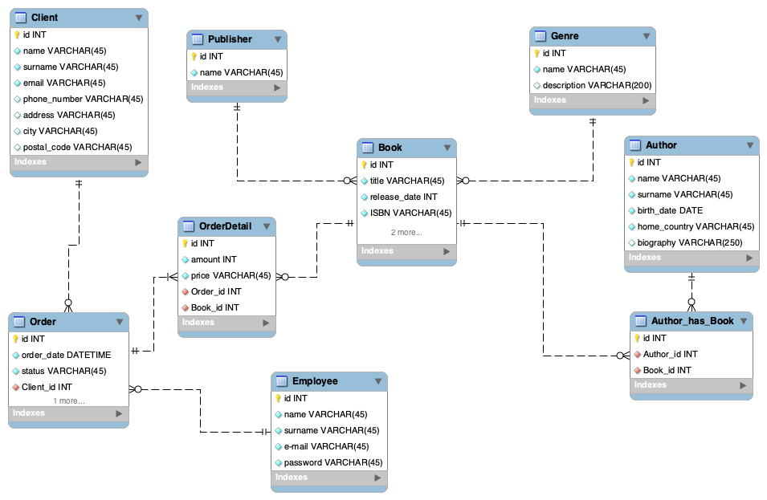

# Book Store database schema

### About
In this catalog you can find SQL code for Book Store database. It has 8 tables:
- Client
- Oredr
- OrderDetail
- Book
- Publisher
- Genre
- Author
- Author_has_Book

This database enables to manage bookstore, with collected data you can check bestsellers, find top genres, publishers or authors.

### You can use code by copying it to your mysql server

## Database scheme

